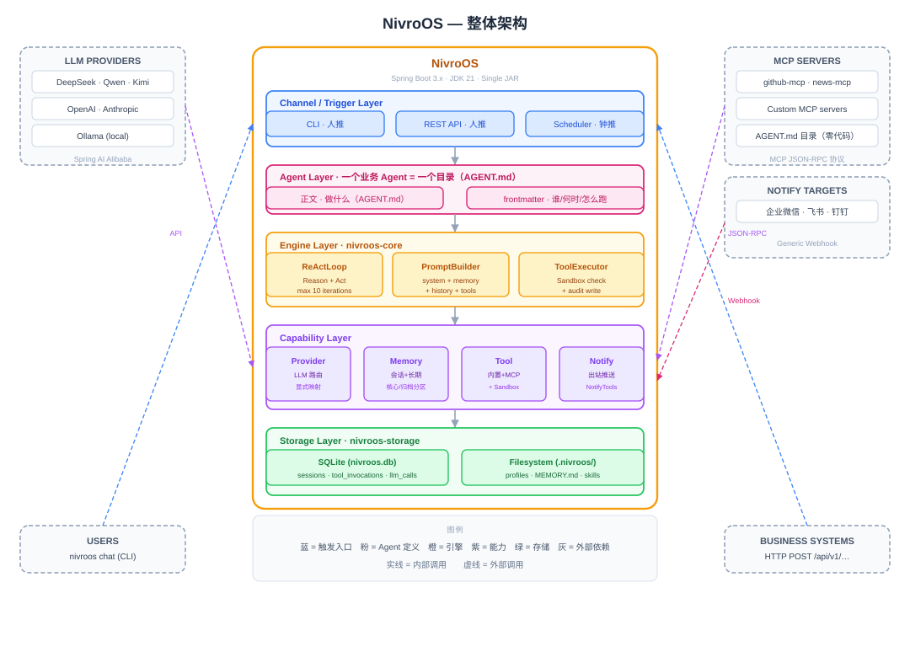

<p align="center">
  
</p>

<p align="center">
  <a href="LICENSE"></a>
  
  
  
  
  
</p>

> An enterprise-grade **Agent OS** built in Java — a unified foundation for running AI agents on your own K8s cluster or servers. Private deployment, fully auditable, aligned with the Java ecosystem.
>
> **Status**: Planning phase. Product design and technical specifications are complete (see [docs/](docs/)); core development has not started yet.

---

## Introduction

NivroOS is a Java-based Agent OS for enterprise scenarios. It installs on your own Kubernetes cluster or servers and acts as a unified foundation for running business agents — ops assistants, customer service agents, HR assistants, sales assistants, knowledge management agents — sharing one set of channel access, model routing, tool invocation, memory, and sandbox execution capabilities. **All data stays on your own infrastructure. No cloud lock-in.**

Open-source Agent OS designs have already been proven in the industry (OpenClaw in Node.js, Hermes Agent in Python), but **no project in the Java ecosystem has claimed the "Agent OS" position**. Java is the de facto standard for enterprise backends; NivroOS fills that gap.

**Two-stage delivery**: the core stage delivers the Agent OS runtime kernel (five core capabilities); the enterprise governance layer (multi-tenancy, SSO, full audit, Tool Policy) is completed in the extension stage and through community contributions.

## Key Features (Five Core Capabilities)

| Capability | Description |
| --- | --- |
| **LLM Provider Abstraction** | Unified abstraction for DeepSeek, Qwen, Kimi, Zhipu, Anthropic, OpenAI and more. Agents never know which model they are calling; hot-swappable with zero lock-in |
| **ReAct Loop** | The agent brain. Self-implemented Reason + Act cycle: LLM thinks → calls tools → observes results → continues reasoning, completing multi-step tasks autonomously |
| **Three-Layer Memory** | Session memory + long-term memory (MEMORY.md file). Remembers user preferences, project context, and key decisions across conversations |
| **Plugin Tool System** | 9 built-in tools (file/shell/HTTP/memory/notify) + three extension tiers: zero-code AGENT.md + MCP (recommended), light-code MCP server, heavy-code `@Tool` Java Bean |
| **Web Service** | Full REST API (10 core endpoints). Business systems integrate over HTTP without caring about internals |

**Core philosophy**: business users write an agent directory (`AGENT.md`) and reuse MCP servers to solve business problems, integrating existing systems through the Web Service — **no agent backend code required**.

## Why NivroOS

- **Private & controllable**: data stays entirely on your own infrastructure; NivroOS itself collects no enterprise data
- **Auditable**: `tool_invocations` / `llm_calls` audit tables are written from day one — full traceability
- **Java ecosystem alignment**: a standard Spring Boot project that plugs directly into existing Java tooling (Nacos, SkyWalking, Prometheus); zero learning cost for IT teams
- **Zero-code extension**: agents are *configured*, not *written* — one directory equals one agent
- **Security by design**: Sandbox whitelist isolation (file paths / shell commands / HTTP domains), credentials via environment variables, controlled tool sources

## Architecture Overview

NivroOS is a Spring Boot 3.x monolith running on JDK 21. It uses Spring AI Alibaba for LLM calls (protocol conversion and `@Tool` schema generation only), a self-implemented ReAct loop as the agent core, SQLite for persistence, and ships as a single executable JAR.



Layered view (top to bottom): **Access layer** (CLI channel / Web Service / scheduled tasks via `AgentScheduler`) → **Engine layer** (`ReActLoop` / `PromptBuilder` / `ToolExecutor`) → **Capability layer** (Provider / Memory / Tool) → **Foundation layer** (Profile / Session storage / SQLite / config & secret loading).

All three trigger sources (CLI, Web Service, scheduled tasks) converge into a single `AgentService` entry point — human-triggered and clock-triggered calls share the same pipeline.

## Quick Start

> The commands below describe the planned product shape and become available once development completes.

```bash
# 1. Initialize the workspace (creates the .nivroos/ directory structure)
nivroos init

# 2. Create an agent (generates a minimal AGENT.md template)
nivroos profile create ops-agent

# 3. Edit .nivroos/agents/ops-agent/AGENT.md: configure provider, tools, and instructions
#    Secrets (API keys) are injected via environment variables, e.g. ${DEEPSEEK_API_KEY}

# 4. Chat with the agent
nivroos chat --profile ops-agent

# 5. Start the Web Service so business systems can integrate over REST
nivroos serve
```

## Documentation

| Doc | Content |
| --- | --- |
| [docs/DemandAnalysis.md](docs/DemandAnalysis.md) | Requirements: functional requirements, acceptance criteria |
| [docs/TechnicalSolution.md](docs/TechnicalSolution.md) | Technical solution: architecture, key decisions, data model |
| [docs/IndustryResearch.md](docs/IndustryResearch.md) | Industry research: Agent OS landscape, Java ecosystem gap |
| [docs/AiProgrammingGuide.md](docs/AiProgrammingGuide.md) | AI programming guide: Spec-Kit implementation breakdown |
| [CLAUDE.md](CLAUDE.md) | Claude Code project guide: constitution, module structure, common pitfalls |

## Project Structure

Maven multi-module (9 modules), `mvn clean package` produces an executable fat JAR:

| Module | Responsibility |
| --- | --- |
| `nivroos-core` | Core abstractions & engine: `NivroTool`, `Session`, `Profile`, `ReActLoop`, `PromptBuilder`, `ToolExecutor`, `AgentService`, `AgentScheduler` |
| `nivroos-provider` | Capability 1: `ProviderService`, explicit provider mapping |
| `nivroos-memory` | Capability 3: `MemoryService` facade, `LongTermMemory`, `MemoryTools` |
| `nivroos-tool` | Capability 4: built-in tools, MCP client, `ToolRegistry`, `Sandbox` |
| `nivroos-channel-cli` | CLI channel |
| `nivroos-web` | Capability 5: `WebServer`, 6 `ApiController`s, OpenAPI |
| `nivroos-storage` | SQLite persistence: session & audit repositories |
| `nivroos-cli` | Picocli entry point, 12 subcommands, `ConfigLoader` |
| `nivroos-boot` | Spring Boot bootstrap module |

## Roadmap

- **Core stage**: runtime kernel — five core capabilities + scheduled tasks + three end-to-end acceptance demos (daily weather, daily tech digest, daily GitHub digest)
- **Extension stage**: enterprise governance layer — more channels (WeCom/Feishu/DingTalk), provider fallback, vector memory, Tool Policy, full sandbox isolation, web dashboard, SSO & multi-tenancy, complete audit, clustered high availability
- **Community**: Skills Marketplace, multi-language SDKs (Python/TypeScript/Go), visual profile editor, Kubernetes Operator, GraalVM Native Image
- **Long term**: from single-node private deployment toward distributed — stateless instances with externalized state (Redis/PostgreSQL), ultimately cross-node agent collaboration

## Contributing

- **Main development**: follow [docs/AiProgrammingGuide.md](docs/AiProgrammingGuide.md) with the Spec-Kit workflow (constitution → specify → plan → tasks → implement), five user stories in dependency order
- **Incremental development**: small changes via Claude Code with direct prompts, then open a PR
- **Must follow**: the constitution (10 non-negotiable principles in [CLAUDE.md](CLAUDE.md)) — JDK 21 + Spring Boot, self-implemented ReAct, no Spring AI auto tool execution, explicit provider mapping, day-one audit table writes
- Community-driven features (documentation, Skills Marketplace, SDKs, etc.) are open to contributions via PR

## Acknowledgments

Project design is inspired by [OryxOS](https://github.com/oryx-labs/oryxos) — sibling projects with shared design philosophy, evolving independently.

## License

[Apache License 2.0](LICENSE)
